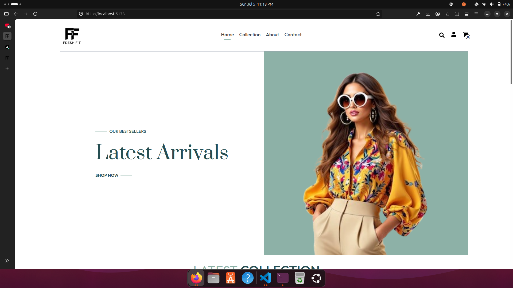
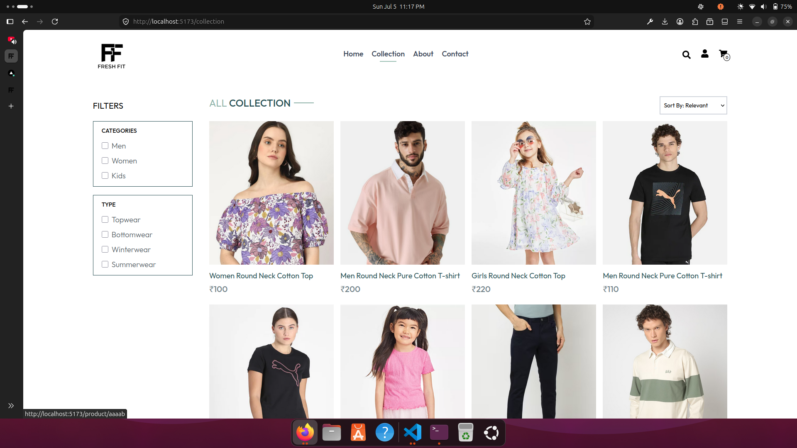
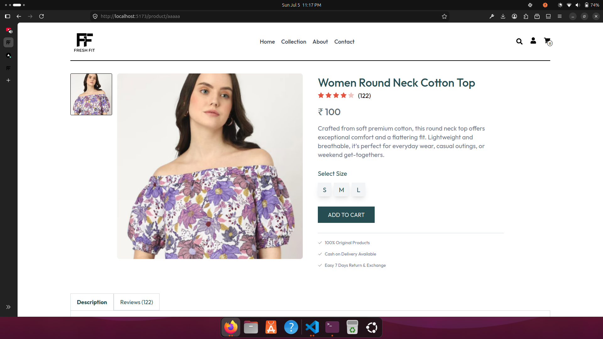
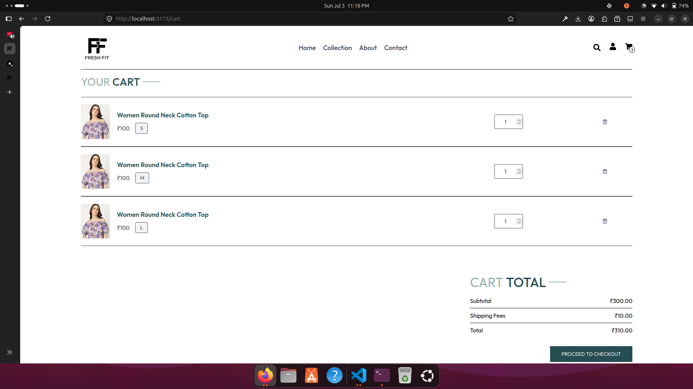

# Fresh Fit

>Fresh Fit is a fully responsive fashion e-commerce frontend designed to provide a clean and intuitive shopping experience. The application features dynamic product browsing, detailed product pages, cart management, filtering, sorting, and responsive layouts. It demonstrates modern frontend development practices using reusable React components and Context API for state management.

---

## Live Demo

https://freshfit-nine.vercel.app/

---

## Preview






- Home Page
- Collection Page
- Product Details
- Shopping Cart

---

# Features

## Home Page

- Responsive landing page
- Hero section
- Latest Collection
- Best Sellers
- Newsletter subscription
- Company policy section

---

## Product Collection

- Browse all products
- Category filtering
- Subcategory filtering
- Sort products by:
  - Relevant
  - Price: Low to High
  - Price: High to Low
- Responsive product grid

---

## Product Details

- Dynamic routing with React Router
- Product image gallery
- Thumbnail image switching
- Product description
- Customer ratings
- Size selection
- Add to Cart functionality
- Related products

---

## Shopping Cart

- Add products to cart
- Quantity management
- Size-specific cart items
- Remove products
- Automatic subtotal calculation
- Shipping fee calculation
- Total price calculation
- Cart summary section

---

## Additional Pages

- About
- Contact
- Place Order

---

## User Experience

- Fully responsive design
- Clean and modern interface
- Reusable React components
- Smooth hover transitions
- Mobile-first layout
- Consistent typography
- Optimized spacing

---

# Tech Stack

| Category | Technology |
|----------|------------|
| Frontend | React.js |
| Build Tool | Vite |
| Styling | Tailwind CSS |
| Routing | React Router DOM |
| State Management | Context API |
| Icons | React Icons |
| Deployment | Vercel |

---

# Folder Structure

```text
FreshFit/
│
├── public/
│
├── src/
│   ├── assets/
│   ├── components/
│   ├── Context/
│   ├── pages/
│   ├── App.jsx
│   ├── main.jsx
│
├── package.json
├── vite.config.js
└── README.md
```

---

# Installation

Clone the repository

```bash
git clone https://github.com/Simauniha/fresh-fit.git
```

Navigate to the project folder

```bash
cd fresh-fit
```

Install dependencies

```bash
npm install
```

Run the development server

```bash
npm run dev
```

Open your browser

```
http://localhost:5173
```

---

# Core Concepts Used

- React Functional Components
- React Hooks
- useState
- useEffect
- useContext
- React Router DOM
- Dynamic Routing
- Context API
- Conditional Rendering
- Component Reusability
- Responsive Design
- Tailwind CSS Utility Classes

---

# Responsive Design

The application is optimized for:

- Mobile
- Tablet
- Laptop
- Desktop

---

# Future Improvements

- Wishlist functionality
- User authentication
- User profile
- Payment gateway integration
- Order history
- Product search
- Customer reviews
- Dark mode

---

# Contributing

Contributions are welcome.

1. Fork the repository.
2. Create a feature branch.

```bash
git checkout -b feature/your-feature
```

3. Commit your changes.

```bash
git commit -m "Add your feature"
```

4. Push to your branch.

```bash
git push origin feature/your-feature
```

5. Open a Pull Request.

---

# Author

**Simauniha**

GitHub

https://github.com/Simauniha

LinkedIn

https://www.linkedin.com/in/omisha-simauniha-39b000361

---